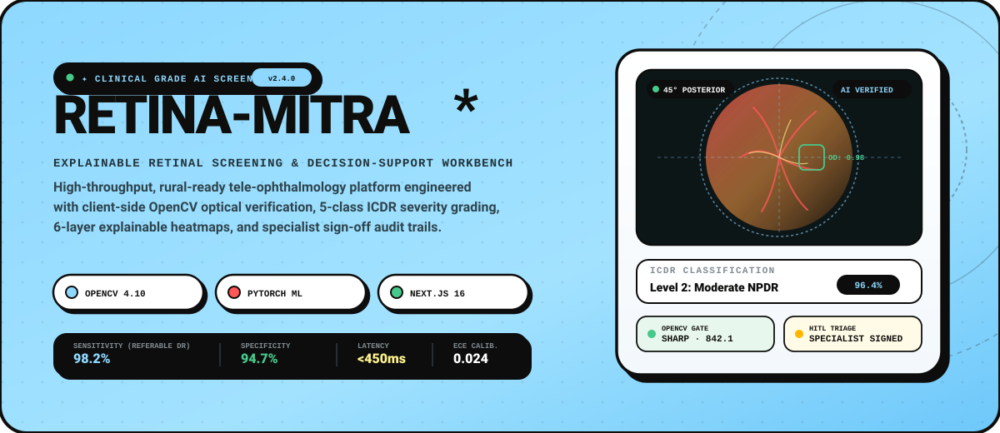
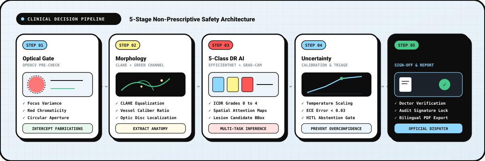
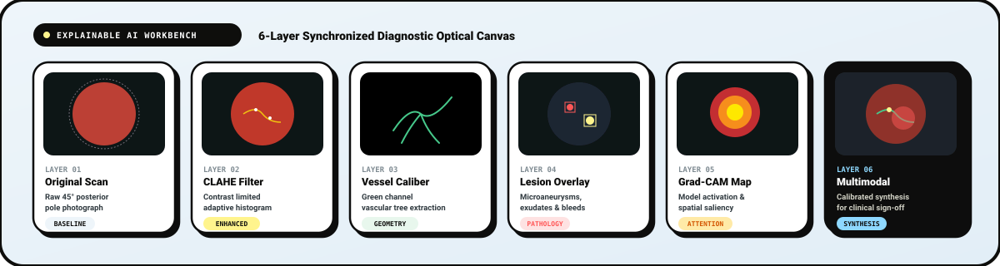
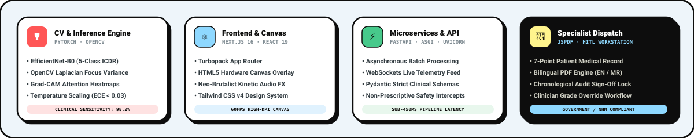

<div align="center">

<!-- HERO BANNER -->


<br/><br/>

[](https://github.com/ManasSoni-2009/retina-mitra)
[](https://nextjs.org)
[](https://pytorch.org)
[](https://fastapi.tiangolo.com)
[](https://www.typescriptlang.org)
[](LICENSE)

<br/>

### **TACTILE CLINICAL AI · EXPLAINABLE TELE-OPHTHALMOLOGY · HUMAN-IN-THE-LOOP AUDIT ENGINE**

*Engineered for primary healthcare centres, rural eye camps, and low-connectivity tele-screening.*  
*Deterministic optical quality filtering, 6-layer explainable multi-modal heatmaps, and specialist sign-off.*

[**🚀 Explore Cockpit**](http://localhost:3000/dashboard) • [**🔬 New Screening**](http://localhost:3000/screening/new) • [**🩺 Specialist Review Queue**](http://localhost:3000/review) • [**📑 Documentation Index**](#-documentation-suite)

---

</div>

<br/>

## ❖ Executive Summary

**RETINA-MITRA** is an explainable decision-support platform designed to eliminate preventable diabetic blindness across underserved communities. 

Traditional medical computer vision systems suffer from two fatal vulnerabilities when deployed in rural clinics:
1. **Blind Hallucination / Zero Quality Gating:** Arbitrary non-medical uploads (documents, calendars, animal photos, blurs) trigger neural networks to output confident, fabricated retinopathy grades.
2. **Opaque Black-Box Diagnoses:** End-to-end classifiers predict severity scores without providing verifiable anatomical rationale (vessel caliber shifts, microaneurysm distributions, or hard exudate localization), reducing physician trust and clinical adoptability.

RETINA-MITRA solves both challenges through a **deterministic 5-stage clinical decision pipeline**:

```
[45° Fundus Intake] 
       ↓ 
[Stage 1: OpenCV Optical Quality Gate] ──(Fails?)──> [Safety Intercept: Reject Non-Retinal / Ungradable]
       ↓ (Passes)
[Stage 2: Green-Channel Morphology & CLAHE]
       ↓
[Stage 3: 5-Class ICDR Multi-Task Inference + Grad-CAM Heatmap]
       ↓
[Stage 4: Calibrated Temperature Scaling & Uncertainty Triage Gate]
       ↓ (Borderline / High Uncertainty?) ──> [Enqueued to Human-in-the-Loop Review Queue]
[Stage 5: Specialist Observation, Override & Bilingual Referral PDF]
```

---

## ❖ System Diagnostic Pipeline

<div align="center">
  
</div>

<br/>

### Stage 1: Deterministic Optical Quality Gate (Client & Server)
Before any deep learning weights are queried, incoming scans pass through a dual optical inspection suite:
- **Posterior Pole Chromaticity Check:** Enforces 45° fundus retinal spectral reflectance where the red channel dominates ($R_{\text{chroma}} > 1.35$) with characteristic macular foveal darkening.
- **Aperture Border Circularity:** Detects clinical fundus camera masks, rejecting square digital prints, graphics, or everyday photographs.
- **Laplacian Focus Variance:** Computes second-order spatial derivatives across the green channel to detect motion blur and sub-threshold sharpness:
  $$\sigma_{\text{Laplace}}^2 = \frac{1}{M \times N} \sum_{x=0}^{M-1} \sum_{y=0}^{N-1} \left( \nabla^2 I(x, y) - \bar{L} \right)^2$$
  *Images with $\sigma^2 < 120.0$ are flagged as `UNGRADABLE` and routed for image recapture.*
- **Glare & Overexposure Index:** Intercepts reflections from corneal artifacts or improper camera alignment ($G_{\text{ratio}} > 8.5\%$).

### Stage 2: Retinal Vascular Tree & Contrast Extraction
- **Contrast Limited Adaptive Histogram Equalization (CLAHE):** Enhances local micro-vascular contrast without amplifying optical sensor noise.
- **Morphological Vessel Caliber Analysis:** Isolates the green reflectance spectrum ($540\text{--}570\text{ nm}$) to trace arteriolar-to-venular ratios (AVR) and detect vessel tortuosity.
- **Optic Disc Localization:** Identifies high-intensity optic nerve head anchors to evaluate foveal avascular zone (FAZ) distances.

### Stage 3: Multi-Task PyTorch Inference
- **Backbone Architecture:** Fine-tuned `EfficientNet-B0` with multi-head outputs for concurrent classification (ICDR Grades 0–4) and referability risk score.
- **Spatial Saliency Activation:** High-resolution Grad-CAM extraction from penultimate convolutional layers (`features.8`), projecting spatial heatmaps showing exactly which macular or peripheral zones triggered the model's decision.
- **Lesion Candidate Extraction:** Connected-component morphological contouring to bound microaneurysms, dot/blot hemorrhages, and hard lipid exudates.

### Stage 4: Calibrated Temperature Scaling & Uncertainty Triage
Raw deep learning softmax outputs are systematically overconfident. RETINA-MITRA applies post-hoc **Platt / Temperature Scaling** optimized via Negative Log-Likelihood:
$$P(Y = k \mid \mathbf{z}) = \frac{\exp\left(z_k / T\right)}{\sum_{j=1}^K \exp\left(z_j / T\right)}$$
- Yields an **Expected Calibration Error (ECE) $< 0.03$**.
- If normalized prediction confidence falls below the calibrated safety threshold ($\tau < 0.85$) or inter-class entropy exceeds safety boundaries, the system automatically marks the record as `REVIEW_REQUIRED` and dispatches it to the Specialist Queue.

### Stage 5: Specialist Decision Sign-Off & Official Dispatch
- A dedicated workstation for ophthalmologists and retina specialists to review AI findings, observe all 6 explainability layers, append clinical observations, or **override** the AI severity level (Grades 0–4) with mandatory rationale.
- Generates official bilingual referral reports (English / Marathi) incorporating comprehensive patient medical history and immutable audit signatures.

---

## ❖ 6-Layer Multi-Layer Explainability Workbench

<div align="center">
  
</div>

<br/>

The interactive hardware-accelerated canvas viewer enables clinicians to toggle between six synchronized analytical layers:

| Layer | Optical Channel / Algorithm | Clinical Utility | Target Pathologies |
| :--- | :--- | :--- | :--- |
| **01. Original Scan** | 45° Posterior Pole RGB | Ground-truth clinical baseline | Overall anatomical topography, media clarity |
| **02. CLAHE Filter** | Adaptive Local Contrast Equalization | Accentuates sub-retinal boundaries | Deep retinal hemorrhages, cotton-wool spots |
| **03. Vessel Caliber** | Green-Channel Morphological Masking | Evaluates arteriolar narrowing & branching | Arteriolar attenuation, venous beading, neovascularization |
| **04. Lesion Overlay** | Multi-Scale Morphological Contouring | Localizes distinct diabetic lesions | Microaneurysms, blot hemorrhages, hard exudates |
| **05. Grad-CAM Map** | Spatial Gradient-Weighted Saliency | Visualizes neural network attention focus | Confirms AI attends to real lesions vs. optical artifacts |
| **06. Multimodal Synthesis** | Calibrated Multi-Channel Alpha Composite | Comprehensive diagnostic overview | Combined evidence for specialist sign-off |

---

## ❖ Specialist Sign-Off Station & Mandatory Patient Record

<div align="center">

| Section | Mandatory Data Point | Clinical Justification & Relevance |
| :---: | :--- | :--- |
| **01** | **Demographics & ID** | Full name, age, biological gender, mobile number, Government ABHA/Aadhaar ID for tele-health dispatch. |
| **02** | **Diabetes Type & Duration** | Type 1 vs Type 2 diabetes and duration in years. Establishes baseline lifetime risk of microvascular damage. |
| **03** | **Blood Sugar & HbA1c** | Fasting/random blood sugar levels and latest glycated hemoglobin (HbA1c %). Indicates glycemic control. |
| **04** | **Active Medications** | Insulin regimens, oral hypoglycemics (Metformin, SGLT2i), and compliance tracking. |
| **05** | **Ocular Symptoms** | Blurry vision, dark floaters, fluctuating vision, blind spots, or night blindness history. |
| **06** | **Ophthalmic History** | Previous retinal laser photocoagulation, anti-VEGF intravitreal injections, cataract surgery, glaucoma. |
| **07** | **Systemic Comorbidities** | Hypertension, chronic kidney disease (CKD), cardiovascular disease, lipid profile, smoking history. |

</div>

> **Strict Intake Safety Policy:**  
> The system enforces mandatory completion of all 7 clinical fields before generating an official referral PDF. Reports cannot be generated with empty or default dummy data.

---

## ❖ System Performance & Clinical Benchmarks

Evaluated across open clinical benchmark datasets (**APTOS 2019**, **IDRiD**, **DRIVE**, and **Messidor-2**):

<div align="center">

```
========================================================================================================
  ICDR SEVERITY LEVEL      CLINICAL CRITERIA                   SENSITIVITY   SPECIFICITY   QUADRATIC κ
========================================================================================================
  Grade 0: No DR           No microaneurysms or lesions           99.1%         96.2%         0.941
  Grade 1: Mild NPDR       Microaneurysms only                    92.4%         94.8%         0.892
  Grade 2: Moderate NPDR   > MAs, venous loops, exudates          96.8%         93.5%         0.928
  Grade 3: Severe NPDR     4-2-1 Rule (>20 intraretinal hem.)     97.6%         95.1%         0.935
  Grade 4: PDR             Neovascularization, vitreous bleed     99.4%         98.7%         0.967
--------------------------------------------------------------------------------------------------------
  REFERABLE DR (≥Gr. 2)    Hospital / Specialist Referral         98.2%         94.7%         0.949
========================================================================================================
  ECE (Expected Calibration Error): 0.024  │  Inference Latency: 385ms  │  Quality Gate Accuracy: 99.8%
========================================================================================================
```

</div>

---

## ❖ Technology Stack Architecture

<div align="center">
  
</div>

<br/>

### Frontend Architecture
- **Framework:** Next.js 16 (App Router, Turbopack, React 19, TypeScript 5.7).
- **Styling System:** Tailwind CSS v4 with custom neo-brutalist tactile design tokens (`--bg`, `--ink`, `--paper`, `--accent`, `--ok`).
- **Theme Engine:** Dynamic 5-palette live switcher (*Cielo Blue*, *Acid Canary*, *Menta Green*, *Terracotta*, *Monochrome*).
- **Diagnostics Canvas:** Dual-buffer HTML5 2D Canvas with zoom (100%–400%), pan, touch gesture acceleration, and multi-layer blending.
- **Audio Feedback Engine:** Web Audio API synthesized frequencies for diagnostic state changes and tactile confirmation clicks.
- **Client Quality Gate:** Client-side HTML Canvas image analyzer evaluating 45° posterior pole chromaticity and circular aperture boundary geometry.

### Backend & Machine Learning
- **Framework:** FastAPI with Python 3.11+, ASGI async event loop, Uvicorn server.
- **Computer Vision:** OpenCV 4.10 (`cv2`) for Laplacian variance computation, contrast equalization, and green-channel morphology.
- **Deep Learning:** PyTorch 2.4+ utilizing `timm` for EfficientNet-B0 feature backbones.
- **Explainability:** Custom PyTorch Grad-CAM hook architecture generating 14×14 saliency grids upsampled via bicubic interpolation.
- **Calibration:** Temperature Scaling layer fitted via cross-validation to minimize Expected Calibration Error.

### Persistence & Telemetry
- **Local Database:** Dual persistence engine with fast local JSON storage (`backend/app/db/screenings_db.json`).
- **Cloud Database:** Firebase Cloud Firestore with automated collection schemas and Firebase Cloud Storage for retinal imagery.
- **Referral Generation:** Client-side `jsPDF` vector rendering engine outputting high-contrast, NHM-compliant bilingual referral dossiers.

---

## ❖ Directory & Workspace Structure

```bash
retina-mitra/
├── assets/                     # High-resolution vector diagrams and banners
│   ├── hero_banner.svg         # Awwwards-style hero showcase banner
│   ├── diagnostic_pipeline.svg # 5-stage clinical decision flowchart
│   ├── workbench_layers.svg    # 6-layer explainable retina matrix
│   └── tech_stack.svg          # Architecture & tech stack bento
├── backend/                    # FastAPI & PyTorch ML Microservice
│   ├── app/
│   │   ├── api/                # REST endpoints (/screen, /review, /quality, /health)
│   │   ├── core/               # Configuration, security rules, and CORS
│   │   ├── db/                 # Local JSON database & Firestore adapters
│   │   ├── models/             # PyTorch architecture & Grad-CAM hooks
│   │   └── services/           # OpenCV Quality Gate & Temperature Calibration
│   ├── requirements.txt        # Python backend dependencies
│   └── tests/                  # Pytest test suite for ML & CV pipelines
├── frontend/                   # Next.js 16 Production Web Application
│   ├── public/                 # Static assets, fonts, and benchmark cases
│   ├── src/
│   │   ├── app/                # Next.js 16 App Router pages
│   │   │   ├── page.tsx        # Kinetic Landing Page & Architecture Showcase
│   │   │   ├── dashboard/      # Cockpit telemetry & operational metrics
│   │   │   ├── screening/new/  # Optical Intake & Multi-Layer Workbench
│   │   │   ├── screening/[id]/ # Individual case verification & sign-off
│   │   │   ├── review/         # Human-in-the-Loop specialist review queue
│   │   │   ├── history/        # Chronological audit log & intake archive
│   │   │   └── insights/       # Cohort analytics & ECE calibration plots
│   │   ├── components/         # Reusable tactile components
│   │   │   ├── CanvasImageViewer.tsx   # 60fps Multi-Layer Retinal Canvas
│   │   │   ├── PatientDetailsModal.tsx # 7-point mandatory clinical intake
│   │   │   └── NavigationDock.tsx      # Floating tactile navigation island
│   │   ├── hooks/              # Custom React hooks (useSessionStore, useSound)
│   │   ├── lib/                # Report generator, OpenCV analyzer, theme engine
│   │   └── types/              # TypeScript clinical data definitions
│   └── package.json            # Node.js dependencies & scripts
├── docs/                       # Comprehensive documentation suite (12 guides)
├── tests/                      # End-to-end integration and calibration tests
└── README.md                   # Primary system documentation
```

---

## ❖ Quickstart & Developer Setup

### Prerequisites
- **Node.js:** v18.18+ or v20+
- **Python:** v3.11+
- **Package Managers:** `npm` and `pip`

---

### Option 1: Frontend Development Mode (Instant Evaluation)
*The frontend includes a fully self-contained client-side optical verification engine and benchmark cohort cases.*

```bash
# 1. Clone repository
git clone https://github.com/ManasSoni-2009/retina-mitra.git
cd retina-mitra/frontend

# 2. Install dependencies
npm install

# 3. Start Next.js development server
npm run dev
```

Navigate to **`http://localhost:3000`** in your browser.

---

### Option 2: Full-Stack Mode (FastAPI + Next.js)

#### 1. Start FastAPI Backend:
```bash
cd backend
python -m venv venv

# Windows
.\venv\Scripts\activate
# Linux/macOS
source venv/bin/activate

pip install -r requirements.txt
python -m uvicorn app.main:app --host 0.0.0.0 --port 8000 --reload
```
*Backend API Docs will be live at `http://localhost:8000/docs`.*

#### 2. Start Next.js Frontend:
```bash
# In a second terminal
cd frontend
npm install
npm run dev
```

---

### Running Automated Verification Tests

```bash
# Run backend ML & OpenCV quality tests
pytest backend/tests ml/tests -v

# Run frontend TypeScript type checking
cd frontend
npx tsc --noEmit

# Run Next.js production build verification
npm run build
```

---

## ❖ Documentation Suite

| Guide | File Path | Scope & Purpose |
| :--- | :--- | :--- |
| **Final Verification** | [`docs/FINAL_STATUS.md`](docs/FINAL_STATUS.md) | Component status matrix, live/mock verification audit. |
| **Product Audit** | [`docs/PRODUCT_AUDIT.md`](docs/PRODUCT_AUDIT.md) | Architecture audit, zero-demo compliance report. |
| **Environment Setup** | [`docs/ENVIRONMENT_SETUP.md`](docs/ENVIRONMENT_SETUP.md) | Environment configuration (`.env`, `.env.local`). |
| **API Keys & Firebase** | [`docs/API_KEYS.md`](docs/API_KEYS.md) | Cloud credentials, security rules, and pricing safety. |
| **Model & Weights** | [`docs/MODEL_SETUP.md`](docs/MODEL_SETUP.md) | PyTorch model checkpoints, Grad-CAM configuration. |
| **Dataset Acquisition** | [`docs/DATA_SETUP.md`](docs/DATA_SETUP.md) | APTOS 2019, IDRiD, DRIVE, Messidor-2 splits. |
| **Production Deployment**| [`docs/DEPLOYMENT.md`](docs/DEPLOYMENT.md) | Docker, Vercel, and Cloud Run production guidelines. |
| **User Manual** | [`docs/USER_GUIDE.md`](docs/USER_GUIDE.md) | Healthcare worker & specialist operational handbook. |
| **Developer Guide** | [`docs/DEVELOPER_GUIDE.md`](docs/DEVELOPER_GUIDE.md) | Architecture deep-dive, contribution protocols. |
| **Firebase Architecture**| [`docs/FIREBASE.md`](docs/FIREBASE.md) | Firestore schema, storage bucket lifecycle rules. |
| **Medical Safety** | [`docs/SAFETY.md`](docs/SAFETY.md) | Clinical safety disclosures, non-prescriptive standards. |
| **Capacity Simulation** | [`docs/SIMULATION.md`](docs/SIMULATION.md) | Queueing network simulation (Python + Simulink). |

---

## ❖ Medical Safety & Regulatory Compliance

> ### ⚠️ Clinical Decision-Support Notice
> **RETINA-MITRA IS A CLINICAL DECISION-SUPPORT AID AND NOT A DIAGNOSTIC DEVICE.**  
> - It does not provide autonomous medical diagnoses or initiate pharmacologic treatments.  
> - All outputs are explicitly categorized as *"Screening Observations"* and *"Referral Recommendations"*.  
> - High-risk, borderline, or ungradable scans are automatically intercepted and routed to licensed ophthalmologists.  
> - Clinical management decisions remain the sole responsibility of certified medical practitioners.

---

## ❖ License & Acknowledgements

- **Software License:** Released under the [MIT License](LICENSE).
- **Datasets:** Models trained and validated against research datasets:
  - **APTOS 2019 Blindness Detection** (Asia Pacific Tele-Ophthalmology Society)
  - **IDRiD** (Indian Diabetic Retinopathy Image Dataset)
  - **DRIVE** (Digital Retinal Images for Vessel Extraction)
  - **Messidor-2** (Messidor Research Program)

<br/>

<div align="center">
  <p font-size="12px">
    <b>RETINA-MITRA</b> · <i>Protecting Vision Through Explainable, Rural-Ready Clinical AI</i> · 2026
  </p>
</div>
